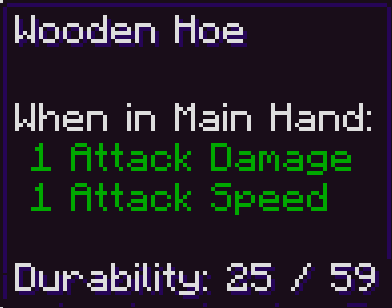

Simple Durability:
is a lightweight mod that adds the current item durability to the tooltip.

Uses vanilla translations keys, so it supports all languages native!

this project trying to be fully vanilla consisted, without overcomplication or unnecessary features like coloring, configuration etc.
